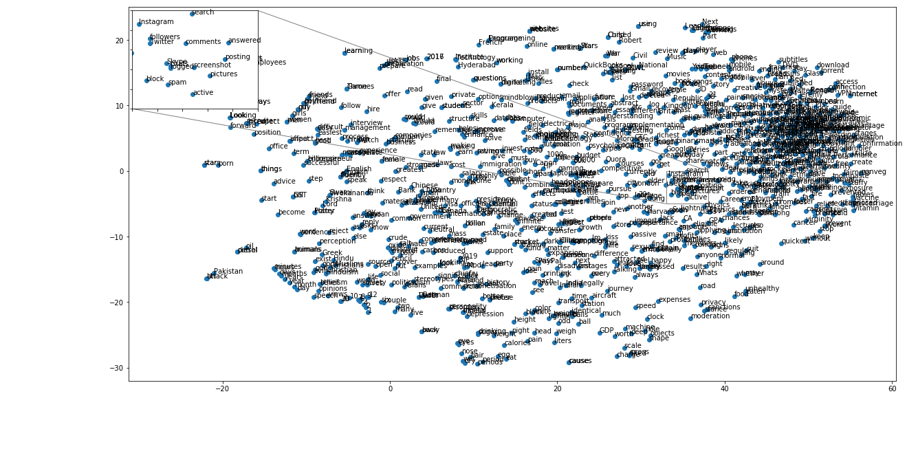
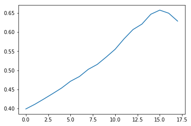

# Quora Question Analysis
## Using Word2Vec and t-SNE 


Below, I explore and analyze a dataset of Quora questions, with the goal of understanding their meaning well enough to identify duplicate questions. I train word2vec on the dataset to generate vector representations of words found in training data set questions, and then I use t-SNE to visualize some of the high-dimensional data stored in the word2vec model and understand how the word2vec model looks.

The data comes from a dataset that Quora recently posted on Kaggle. The aim of the competition they are hosting is to identify questions which have the same intent, but may be phrased or worded differently. I create a scoring algorithm based on the word2vec model I've created, in order to evaluate the cosine similarity between pairs of questions and predict whether they are duplicates or not.

- __Load and Preview Data__
- __Formatting and Processing Data__
- __Train Word2Vec Model__
- __Visualize Word2Vec Model with t-SNE__
- __Determining Question Similarity Using Word2Vec Scores__


# Load and Preview Data

First, we'll load the libraries necessary for manipulating and exploring this dataset. These include:
- __Word2Vec__: [Gensim Word2Vec](https://radimrehurek.com/gensim/models/word2vec.html) is one of many implementation of Word2Vec, which allows us to generate high-dimensional vectors to represent each of the words in our corpus of Quora questions. Using high-dimensional vectors to represent each word allows us to view how they relate to other words in the corpus. We can use this representation of data to learn and store contextual meaning of the words in our datasets. 
- __NumPy__: The [NumPy](http://www.numpy.org/) library allows us to manipulate arrays and perform linear algebra operations.
- __Pandas__: The [Pandas]() library is useful for loading and manipulating our CSV dataset.
- __string__ and __nltk__: These libraries contain tools that allow us to prepare and process our text to ready it for __Word2Vec__ and to load it into the model for analysis.


```python
from gensim.models import Word2Vec
# from gensim.models.doc2vec import LabeledSentence
# from gensim.matutils import unitvec
import numpy as np
import pandas as pd
import nltk
import string
from nltk.corpus import stopwords

import logging
logging.root.handlers = []
logging.basicConfig(format='%(asctime)s : %(levelname)s : %(message)s', level=logging.INFO)
```

Next, we will load and preview our dataset. We can see that our dataset includes the following fields:

- __id__: Unique numerical identifier for pair of questions
- __qid1__: Unique numerical identifier for first question in each pair
- __qid2__: Unique numerical identifier for second question in each pair
- __question1__: Text of first question in each pair
- __question2__: Text of second question in each pair
- __is_duplicate__: Training set label as to whether the two questions in a pair are duplicates. 0 means they are not duplicates, 1 means they are duplicates.


```python
# Read in and show the first few examples from our training set
q_train = pd.read_csv('train.csv')

q_train[:15]
```


<div>
<table border="1" class="dataframe">
  <thead>
    <tr style="text-align: right;">
      <th></th>
      <th>id</th>
      <th>qid1</th>
      <th>qid2</th>
      <th>question1</th>
      <th>question2</th>
      <th>is_duplicate</th>
    </tr>
  </thead>
  <tbody>
    <tr>
      <th>0</th>
      <td>0</td>
      <td>1</td>
      <td>2</td>
      <td>What is the step by step guide to invest in sh...</td>
      <td>What is the step by step guide to invest in sh...</td>
      <td>0</td>
    </tr>
    <tr>
      <th>1</th>
      <td>1</td>
      <td>3</td>
      <td>4</td>
      <td>What is the story of Kohinoor (Koh-i-Noor) Dia...</td>
      <td>What would happen if the Indian government sto...</td>
      <td>0</td>
    </tr>
    <tr>
      <th>2</th>
      <td>2</td>
      <td>5</td>
      <td>6</td>
      <td>How can I increase the speed of my internet co...</td>
      <td>How can Internet speed be increased by hacking...</td>
      <td>0</td>
    </tr>
    <tr>
      <th>3</th>
      <td>3</td>
      <td>7</td>
      <td>8</td>
      <td>Why am I mentally very lonely? How can I solve...</td>
      <td>Find the remainder when [math]23^{24}[/math] i...</td>
      <td>0</td>
    </tr>
    <tr>
      <th>4</th>
      <td>4</td>
      <td>9</td>
      <td>10</td>
      <td>Which one dissolve in water quikly sugar, salt...</td>
      <td>Which fish would survive in salt water?</td>
      <td>0</td>
    </tr>
    <tr>
      <th>5</th>
      <td>5</td>
      <td>11</td>
      <td>12</td>
      <td>Astrology: I am a Capricorn Sun Cap moon and c...</td>
      <td>I'm a triple Capricorn (Sun, Moon and ascendan...</td>
      <td>1</td>
    </tr>
    <tr>
      <th>6</th>
      <td>6</td>
      <td>13</td>
      <td>14</td>
      <td>Should I buy tiago?</td>
      <td>What keeps childern active and far from phone ...</td>
      <td>0</td>
    </tr>
    <tr>
      <th>7</th>
      <td>7</td>
      <td>15</td>
      <td>16</td>
      <td>How can I be a good geologist?</td>
      <td>What should I do to be a great geologist?</td>
      <td>1</td>
    </tr>
    <tr>
      <th>8</th>
      <td>8</td>
      <td>17</td>
      <td>18</td>
      <td>When do you use シ instead of し?</td>
      <td>When do you use "&amp;" instead of "and"?</td>
      <td>0</td>
    </tr>
    <tr>
      <th>9</th>
      <td>9</td>
      <td>19</td>
      <td>20</td>
      <td>Motorola (company): Can I hack my Charter Moto...</td>
      <td>How do I hack Motorola DCX3400 for free internet?</td>
      <td>0</td>
    </tr>
    <tr>
      <th>10</th>
      <td>10</td>
      <td>21</td>
      <td>22</td>
      <td>Method to find separation of slits using fresn...</td>
      <td>What are some of the things technicians can te...</td>
      <td>0</td>
    </tr>
    <tr>
      <th>11</th>
      <td>11</td>
      <td>23</td>
      <td>24</td>
      <td>How do I read and find my YouTube comments?</td>
      <td>How can I see all my Youtube comments?</td>
      <td>1</td>
    </tr>
    <tr>
      <th>12</th>
      <td>12</td>
      <td>25</td>
      <td>26</td>
      <td>What can make Physics easy to learn?</td>
      <td>How can you make physics easy to learn?</td>
      <td>1</td>
    </tr>
    <tr>
      <th>13</th>
      <td>13</td>
      <td>27</td>
      <td>28</td>
      <td>What was your first sexual experience like?</td>
      <td>What was your first sexual experience?</td>
      <td>1</td>
    </tr>
    <tr>
      <th>14</th>
      <td>14</td>
      <td>29</td>
      <td>30</td>
      <td>What are the laws to change your status from a...</td>
      <td>What are the laws to change your status from a...</td>
      <td>0</td>
    </tr>
  </tbody>
</table>
</div>


# Formatting and Processing Data

After confirming how our data is structured, we need to prepare the text of the questions in our training set into a format suitable for training a word2vec model. This means that, instead of keeping our questions in a string format, we need to [tokenize](https://nlp.stanford.edu/IR-book/html/htmledition/tokenization-1.html) each of them. Tokenization involves splitting up each question into a list of words.

While we are tokenizing, we also need to clean the dataset of words so that our word2vec model has a better understanding of overlapping contextual topics found in questions. Since we are more interested in the topics of these questions than in their grammatical format, we can go ahead and filter out all of the [stop words](https://en.wikipedia.org/wiki/Stop_words) (such as __the, is, at__ and __which__) while we are tokenizing each question.

We will store the tokenized format of each question into a new Panda series called __filteredQuestions__.


```python
# Create a series of all questions in the training data set
q_train_series = pd.Series(q_train['question1'].tolist() + q_train['question2'].tolist()).astype(str)

# We imported stopwords from the ntlk library, as well as string, above
# Here, we create sets of English stopwords and punctuation marks
s = set(stopwords.words('english'))
exclude = set(string.punctuation)

# This method allows us to tokenize and filter each question to prepare for word2vec
def filterStopWordsAndPunct(queryWords):
    
    # First, we remove all punctuation marks from the question
    queryWords = ''.join(ch for ch in queryWords if ch not in exclude)
    
    # Then, we split up the words into a list (tokenization)
    qwords = queryWords.split()
    
    # Finally, we filter out any words found in our set of stopwords
    resultwords  = [word for word in qwords if word.lower() not in s]
    
    return resultwords

# Let's create filteredQuestions, a new set to store all of our tokenized questions inside of
filteredQuestions = q_train_series.copy()

# Now let's tokenize each of our questions and store it inside of filteredQuestions
for index, value in q_train_series.items():
    filteredQuestions[index] = filterStopWordsAndPunct(value)

```


# Train Word2Vec Model

Below, we can see what some of our filtered and tokenized questions look like, by previewing the Series we created above. It is easy to see how, by filtering out stop words, we have kept only the necessary key words that are necessary to reconstruct and understand the meaning of each of these intriguing questions.

This preparation will ensure that our word2vec model is trained in a manner that allows the high-dimensional vector for each word to store only the most important contextual information.


```python
filteredQuestions.values[:20]
```


    array([['step', 'step', 'guide', 'invest', 'share', 'market', 'india'],
           ['story', 'Kohinoor', 'KohiNoor', 'Diamond'],
           ['increase', 'speed', 'internet', 'connection', 'using', 'VPN'],
           ['mentally', 'lonely', 'solve'],
           ['one', 'dissolve', 'water', 'quikly', 'sugar', 'salt', 'methane', 'carbon', 'di', 'oxide'],
           ['Astrology', 'Capricorn', 'Sun', 'Cap', 'moon', 'cap', 'risingwhat', 'say'],
           ['buy', 'tiago'], ['good', 'geologist'],
           ['use', 'シ', 'instead', 'し'],
           ['Motorola', 'company', 'hack', 'Charter', 'Motorolla', 'DCX3400'],
           ['Method', 'find', 'separation', 'slits', 'using', 'fresnel', 'biprism'],
           ['read', 'find', 'YouTube', 'comments'],
           ['make', 'Physics', 'easy', 'learn'],
           ['first', 'sexual', 'experience', 'like'],
           ['laws', 'change', 'status', 'student', 'visa', 'green', 'card', 'US', 'compare', 'immigration', 'laws', 'Canada'],
           ['would', 'Trump', 'presidency', 'mean', 'current', 'international', 'master’s', 'students', 'F1', 'visa'],
           ['manipulation', 'mean'],
           ['girls', 'want', 'friends', 'guy', 'reject'],
           ['many', 'Quora', 'users', 'posting', 'questions', 'readily', 'answered', 'Google'],
           ['best', 'digital', 'marketing', 'institution', 'banglore']], dtype=object)


The Gensim Word2Vec tool makes training our model quite easy. We can pass in the values of the Series of tokenized and filtered questions, and specify parameters such as:

- `size`: specifies how high-dimensional the feature vectors for each word should be.
- `window`: specifies maximum possible distance between current word and predicted word in a sentence.
- `sg`: specifies which algorithm is used to train the neural network. If set to 1, skip-gram is used. Otherwise, by default, the continuous bag-of-words algorithm is used.

The log below shows the steps involved in collecting the words in the full corpus and training the Word2Vec model on them.


```python
model = Word2Vec(filteredQuestions.values, size=100, window=5)
```

    2017-04-16 18:47:25,580 : INFO : collecting all words and their counts
    2017-04-16 18:47:25,582 : INFO : PROGRESS: at sentence #0, processed 0 words, keeping 0 word types
    2017-04-16 18:47:25,605 : INFO : PROGRESS: at sentence #10000, processed 55066 words, keeping 13545 word types
    2017-04-16 18:47:25,641 : INFO : PROGRESS: at sentence #20000, processed 110321 words, keeping 20153 word types
    2017-04-16 18:47:25,695 : INFO : PROGRESS: at sentence #30000, processed 165268 words, keeping 25268 word types
    2017-04-16 18:47:25,762 : INFO : PROGRESS: at sentence #40000, processed 219826 words, keeping 29579 word types
    2017-04-16 18:47:25,869 : INFO : PROGRESS: at sentence #50000, processed 275098 words, keeping 33599 word types
    2017-04-16 18:47:25,922 : INFO : PROGRESS: at sentence #60000, processed 330139 words, keeping 37137 word types
    2017-04-16 18:47:26,007 : INFO : PROGRESS: at sentence #70000, processed 385134 words, keeping 40234 word types
    2017-04-16 18:47:26,102 : INFO : PROGRESS: at sentence #80000, processed 440258 words, keeping 43055 word types
    2017-04-16 18:47:26,205 : INFO : PROGRESS: at sentence #90000, processed 495286 words, keeping 45801 word types
    2017-04-16 18:47:26,295 : INFO : PROGRESS: at sentence #100000, processed 550281 words, keeping 48447 word types
    2017-04-16 18:47:26,394 : INFO : PROGRESS: at sentence #110000, processed 604652 words, keeping 50905 word types
    2017-04-16 18:47:26,416 : INFO : PROGRESS: at sentence #120000, processed 659485 words, keeping 53295 word types
    2017-04-16 18:47:26,512 : INFO : PROGRESS: at sentence #130000, processed 714703 words, keeping 55625 word types
    2017-04-16 18:47:26,539 : INFO : PROGRESS: at sentence #140000, processed 769684 words, keeping 57740 word types
    2017-04-16 18:47:26,601 : INFO : PROGRESS: at sentence #150000, processed 825035 words, keeping 59933 word types
    2017-04-16 18:47:26,632 : INFO : PROGRESS: at sentence #160000, processed 880416 words, keeping 62073 word types
    2017-04-16 18:47:26,698 : INFO : PROGRESS: at sentence #170000, processed 935645 words, keeping 64074 word types
    2017-04-16 18:47:26,760 : INFO : PROGRESS: at sentence #180000, processed 991077 words, keeping 66029 word types
    2017-04-16 18:47:26,805 : INFO : PROGRESS: at sentence #190000, processed 1046201 words, keeping 67892 word types
    2017-04-16 18:47:26,851 : INFO : PROGRESS: at sentence #200000, processed 1100917 words, keeping 69734 word types
    2017-04-16 18:47:26,898 : INFO : PROGRESS: at sentence #210000, processed 1155599 words, keeping 71533 word types
    2017-04-16 18:47:26,941 : INFO : PROGRESS: at sentence #220000, processed 1210471 words, keeping 73211 word types
    2017-04-16 18:47:26,987 : INFO : PROGRESS: at sentence #230000, processed 1266067 words, keeping 74941 word types
    2017-04-16 18:47:27,039 : INFO : PROGRESS: at sentence #240000, processed 1321076 words, keeping 76560 word types
    2017-04-16 18:47:27,143 : INFO : PROGRESS: at sentence #250000, processed 1376715 words, keeping 78169 word types
    2017-04-16 18:47:27,173 : INFO : PROGRESS: at sentence #260000, processed 1432248 words, keeping 79770 word types
    2017-04-16 18:47:27,242 : INFO : PROGRESS: at sentence #270000, processed 1487831 words, keeping 81322 word types
    2017-04-16 18:47:27,348 : INFO : PROGRESS: at sentence #280000, processed 1542831 words, keeping 82825 word types
    2017-04-16 18:47:27,442 : INFO : PROGRESS: at sentence #290000, processed 1598092 words, keeping 84316 word types
    2017-04-16 18:47:27,495 : INFO : PROGRESS: at sentence #300000, processed 1652861 words, keeping 85823 word types
    2017-04-16 18:47:27,579 : INFO : PROGRESS: at sentence #310000, processed 1707937 words, keeping 87267 word types
    2017-04-16 18:47:27,673 : INFO : PROGRESS: at sentence #320000, processed 1762863 words, keeping 88631 word types
    2017-04-16 18:47:27,694 : INFO : PROGRESS: at sentence #330000, processed 1818330 words, keeping 90076 word types
    2017-04-16 18:47:27,727 : INFO : PROGRESS: at sentence #340000, processed 1873266 words, keeping 91371 word types
    2017-04-16 18:47:27,779 : INFO : PROGRESS: at sentence #350000, processed 1928414 words, keeping 92652 word types
    2017-04-16 18:47:27,855 : INFO : PROGRESS: at sentence #360000, processed 1983438 words, keeping 93949 word types
    2017-04-16 18:47:27,918 : INFO : PROGRESS: at sentence #370000, processed 2038566 words, keeping 95244 word types
    2017-04-16 18:47:28,050 : INFO : PROGRESS: at sentence #380000, processed 2093920 words, keeping 96559 word types
    2017-04-16 18:47:28,101 : INFO : PROGRESS: at sentence #390000, processed 2149934 words, keeping 97893 word types
    2017-04-16 18:47:28,146 : INFO : PROGRESS: at sentence #400000, processed 2205563 words, keeping 99104 word types
    2017-04-16 18:47:28,192 : INFO : PROGRESS: at sentence #410000, processed 2261345 words, keeping 100244 word types
    2017-04-16 18:47:28,276 : INFO : PROGRESS: at sentence #420000, processed 2316960 words, keeping 101339 word types
    2017-04-16 18:47:28,299 : INFO : PROGRESS: at sentence #430000, processed 2372924 words, keeping 102448 word types
    2017-04-16 18:47:28,370 : INFO : PROGRESS: at sentence #440000, processed 2428503 words, keeping 103432 word types
    2017-04-16 18:47:28,430 : INFO : PROGRESS: at sentence #450000, processed 2484583 words, keeping 104369 word types
    2017-04-16 18:47:28,459 : INFO : PROGRESS: at sentence #460000, processed 2540386 words, keeping 105355 word types
    2017-04-16 18:47:28,568 : INFO : PROGRESS: at sentence #470000, processed 2596088 words, keeping 106367 word types
    2017-04-16 18:47:28,638 : INFO : PROGRESS: at sentence #480000, processed 2651995 words, keeping 107373 word types
    2017-04-16 18:47:28,661 : INFO : PROGRESS: at sentence #490000, processed 2707983 words, keeping 108331 word types
    2017-04-16 18:47:28,714 : INFO : PROGRESS: at sentence #500000, processed 2763996 words, keeping 109296 word types
    2017-04-16 18:47:28,808 : INFO : PROGRESS: at sentence #510000, processed 2818862 words, keeping 110238 word types
    2017-04-16 18:47:28,868 : INFO : PROGRESS: at sentence #520000, processed 2874451 words, keeping 111157 word types
    2017-04-16 18:47:28,924 : INFO : PROGRESS: at sentence #530000, processed 2930602 words, keeping 112047 word types
    2017-04-16 18:47:29,016 : INFO : PROGRESS: at sentence #540000, processed 2986730 words, keeping 113056 word types
    2017-04-16 18:47:29,074 : INFO : PROGRESS: at sentence #550000, processed 3043060 words, keeping 114025 word types
    2017-04-16 18:47:29,115 : INFO : PROGRESS: at sentence #560000, processed 3099088 words, keeping 114936 word types
    2017-04-16 18:47:29,170 : INFO : PROGRESS: at sentence #570000, processed 3155285 words, keeping 115805 word types
    2017-04-16 18:47:29,251 : INFO : PROGRESS: at sentence #580000, processed 3211557 words, keeping 116683 word types
    2017-04-16 18:47:29,440 : INFO : PROGRESS: at sentence #590000, processed 3268029 words, keeping 117547 word types
    2017-04-16 18:47:29,492 : INFO : PROGRESS: at sentence #600000, processed 3323219 words, keeping 118375 word types
    2017-04-16 18:47:29,616 : INFO : PROGRESS: at sentence #610000, processed 3379258 words, keeping 119270 word types
    2017-04-16 18:47:29,691 : INFO : PROGRESS: at sentence #620000, processed 3435028 words, keeping 120132 word types
    2017-04-16 18:47:29,781 : INFO : PROGRESS: at sentence #630000, processed 3490724 words, keeping 121045 word types
    2017-04-16 18:47:29,820 : INFO : PROGRESS: at sentence #640000, processed 3545867 words, keeping 121879 word types
    2017-04-16 18:47:29,858 : INFO : PROGRESS: at sentence #650000, processed 3601886 words, keeping 122735 word types
    2017-04-16 18:47:29,893 : INFO : PROGRESS: at sentence #660000, processed 3657562 words, keeping 123641 word types
    2017-04-16 18:47:29,994 : INFO : PROGRESS: at sentence #670000, processed 3713757 words, keeping 124525 word types
    2017-04-16 18:47:30,113 : INFO : PROGRESS: at sentence #680000, processed 3770087 words, keeping 125468 word types
    2017-04-16 18:47:30,199 : INFO : PROGRESS: at sentence #690000, processed 3825909 words, keeping 126304 word types
    2017-04-16 18:47:30,311 : INFO : PROGRESS: at sentence #700000, processed 3881645 words, keeping 127173 word types
    2017-04-16 18:47:30,472 : INFO : PROGRESS: at sentence #710000, processed 3937012 words, keeping 127976 word types
    2017-04-16 18:47:30,549 : INFO : PROGRESS: at sentence #720000, processed 3993057 words, keeping 128795 word types
    2017-04-16 18:47:30,656 : INFO : PROGRESS: at sentence #730000, processed 4048365 words, keeping 129592 word types
    2017-04-16 18:47:30,713 : INFO : PROGRESS: at sentence #740000, processed 4104115 words, keeping 130380 word types
    2017-04-16 18:47:30,741 : INFO : PROGRESS: at sentence #750000, processed 4159707 words, keeping 131149 word types
    2017-04-16 18:47:30,808 : INFO : PROGRESS: at sentence #760000, processed 4215635 words, keeping 131919 word types
    2017-04-16 18:47:30,844 : INFO : PROGRESS: at sentence #770000, processed 4271595 words, keeping 132711 word types
    2017-04-16 18:47:30,915 : INFO : PROGRESS: at sentence #780000, processed 4327378 words, keeping 133473 word types
    2017-04-16 18:47:30,942 : INFO : PROGRESS: at sentence #790000, processed 4383334 words, keeping 134355 word types
    2017-04-16 18:47:30,980 : INFO : PROGRESS: at sentence #800000, processed 4440048 words, keeping 135126 word types
    2017-04-16 18:47:31,025 : INFO : collected 135755 word types from a corpus of 4488531 raw words and 808580 sentences
    2017-04-16 18:47:31,026 : INFO : Loading a fresh vocabulary
    2017-04-16 18:47:31,243 : INFO : min_count=5 retains 36680 unique words (27% of original 135755, drops 99075)
    2017-04-16 18:47:31,244 : INFO : min_count=5 leaves 4334597 word corpus (96% of original 4488531, drops 153934)
    2017-04-16 18:47:31,443 : INFO : deleting the raw counts dictionary of 135755 items
    2017-04-16 18:47:31,450 : INFO : sample=0.001 downsamples 22 most-common words
    2017-04-16 18:47:31,451 : INFO : downsampling leaves estimated 4182229 word corpus (96.5% of prior 4334597)
    2017-04-16 18:47:31,453 : INFO : estimated required memory for 36680 words and 100 dimensions: 47684000 bytes
    2017-04-16 18:47:31,737 : INFO : resetting layer weights
    2017-04-16 18:47:32,336 : INFO : training model with 3 workers on 36680 vocabulary and 100 features, using sg=0 hs=0 sample=0.001 negative=5 window=5
    2017-04-16 18:47:32,337 : INFO : expecting 808580 sentences, matching count from corpus used for vocabulary survey
    2017-04-16 18:47:33,389 : INFO : PROGRESS: at 3.24% examples, 645209 words/s, in_qsize 5, out_qsize 0
    2017-04-16 18:47:34,430 : INFO : PROGRESS: at 6.20% examples, 617372 words/s, in_qsize 5, out_qsize 0
    2017-04-16 18:47:35,434 : INFO : PROGRESS: at 8.80% examples, 591125 words/s, in_qsize 5, out_qsize 0
    2017-04-16 18:47:36,450 : INFO : PROGRESS: at 10.71% examples, 542341 words/s, in_qsize 6, out_qsize 0
    2017-04-16 18:47:37,452 : INFO : PROGRESS: at 13.94% examples, 569349 words/s, in_qsize 5, out_qsize 0
    2017-04-16 18:47:38,463 : INFO : PROGRESS: at 17.04% examples, 582084 words/s, in_qsize 4, out_qsize 1
    2017-04-16 18:47:39,533 : INFO : PROGRESS: at 19.83% examples, 577225 words/s, in_qsize 3, out_qsize 2
    2017-04-16 18:47:40,550 : INFO : PROGRESS: at 21.98% examples, 560072 words/s, in_qsize 5, out_qsize 0
    2017-04-16 18:47:41,598 : INFO : PROGRESS: at 23.96% examples, 540846 words/s, in_qsize 5, out_qsize 0
    2017-04-16 18:47:42,618 : INFO : PROGRESS: at 25.66% examples, 521498 words/s, in_qsize 6, out_qsize 0
    2017-04-16 18:47:43,620 : INFO : PROGRESS: at 27.00% examples, 499907 words/s, in_qsize 5, out_qsize 0
    2017-04-16 18:47:44,643 : INFO : PROGRESS: at 29.11% examples, 493822 words/s, in_qsize 5, out_qsize 0
    2017-04-16 18:47:45,672 : INFO : PROGRESS: at 30.93% examples, 484356 words/s, in_qsize 4, out_qsize 1
    2017-04-16 18:47:46,717 : INFO : PROGRESS: at 31.90% examples, 463405 words/s, in_qsize 5, out_qsize 0
    2017-04-16 18:47:47,720 : INFO : PROGRESS: at 33.06% examples, 448982 words/s, in_qsize 5, out_qsize 0
    2017-04-16 18:47:48,729 : INFO : PROGRESS: at 34.47% examples, 439570 words/s, in_qsize 6, out_qsize 0
    2017-04-16 18:47:49,745 : INFO : PROGRESS: at 35.35% examples, 424637 words/s, in_qsize 5, out_qsize 0
    2017-04-16 18:47:50,796 : INFO : PROGRESS: at 37.12% examples, 420660 words/s, in_qsize 5, out_qsize 0
    2017-04-16 18:47:51,809 : INFO : PROGRESS: at 39.34% examples, 422756 words/s, in_qsize 4, out_qsize 1
    2017-04-16 18:47:52,810 : INFO : PROGRESS: at 41.26% examples, 421631 words/s, in_qsize 5, out_qsize 1
    2017-04-16 18:47:53,837 : INFO : PROGRESS: at 43.42% examples, 422251 words/s, in_qsize 5, out_qsize 0
    2017-04-16 18:47:54,839 : INFO : PROGRESS: at 45.44% examples, 422030 words/s, in_qsize 6, out_qsize 0
    2017-04-16 18:47:55,840 : INFO : PROGRESS: at 47.36% examples, 421054 words/s, in_qsize 5, out_qsize 0
    2017-04-16 18:47:56,850 : INFO : PROGRESS: at 49.07% examples, 418118 words/s, in_qsize 6, out_qsize 0
    2017-04-16 18:47:57,857 : INFO : PROGRESS: at 50.58% examples, 414004 words/s, in_qsize 5, out_qsize 0
    2017-04-16 18:47:58,865 : INFO : PROGRESS: at 52.26% examples, 411655 words/s, in_qsize 6, out_qsize 0
    2017-04-16 18:47:59,865 : INFO : PROGRESS: at 53.90% examples, 409237 words/s, in_qsize 5, out_qsize 0
    2017-04-16 18:48:00,872 : INFO : PROGRESS: at 55.84% examples, 409193 words/s, in_qsize 5, out_qsize 0
    2017-04-16 18:48:01,897 : INFO : PROGRESS: at 57.44% examples, 406366 words/s, in_qsize 5, out_qsize 0
    2017-04-16 18:48:02,907 : INFO : PROGRESS: at 59.03% examples, 403926 words/s, in_qsize 5, out_qsize 0
    2017-04-16 18:48:03,926 : INFO : PROGRESS: at 61.22% examples, 405342 words/s, in_qsize 5, out_qsize 0
    2017-04-16 18:48:04,944 : INFO : PROGRESS: at 63.60% examples, 407795 words/s, in_qsize 4, out_qsize 1
    2017-04-16 18:48:05,957 : INFO : PROGRESS: at 65.62% examples, 407942 words/s, in_qsize 4, out_qsize 1
    2017-04-16 18:48:06,985 : INFO : PROGRESS: at 67.27% examples, 405772 words/s, in_qsize 5, out_qsize 0
    2017-04-16 18:48:08,029 : INFO : PROGRESS: at 69.11% examples, 404575 words/s, in_qsize 4, out_qsize 1
    2017-04-16 18:48:09,034 : INFO : PROGRESS: at 70.62% examples, 402122 words/s, in_qsize 4, out_qsize 1
    2017-04-16 18:48:10,042 : INFO : PROGRESS: at 72.17% examples, 400035 words/s, in_qsize 5, out_qsize 0
    2017-04-16 18:48:11,081 : INFO : PROGRESS: at 74.03% examples, 399429 words/s, in_qsize 5, out_qsize 1
    2017-04-16 18:48:12,104 : INFO : PROGRESS: at 75.89% examples, 399019 words/s, in_qsize 5, out_qsize 0
    2017-04-16 18:48:13,105 : INFO : PROGRESS: at 78.37% examples, 402035 words/s, in_qsize 5, out_qsize 0
    2017-04-16 18:48:14,118 : INFO : PROGRESS: at 80.95% examples, 405232 words/s, in_qsize 6, out_qsize 0
    2017-04-16 18:48:15,151 : INFO : PROGRESS: at 82.70% examples, 403918 words/s, in_qsize 5, out_qsize 1
    2017-04-16 18:48:16,204 : INFO : PROGRESS: at 84.04% examples, 400585 words/s, in_qsize 6, out_qsize 0
    2017-04-16 18:48:17,218 : INFO : PROGRESS: at 86.06% examples, 400848 words/s, in_qsize 5, out_qsize 0
    2017-04-16 18:48:18,222 : INFO : PROGRESS: at 88.08% examples, 401192 words/s, in_qsize 5, out_qsize 0
    2017-04-16 18:48:19,224 : INFO : PROGRESS: at 90.58% examples, 403739 words/s, in_qsize 5, out_qsize 0
    2017-04-16 18:48:20,259 : INFO : PROGRESS: at 92.88% examples, 405146 words/s, in_qsize 6, out_qsize 0
    2017-04-16 18:48:21,263 : INFO : PROGRESS: at 94.47% examples, 403698 words/s, in_qsize 6, out_qsize 0
    2017-04-16 18:48:22,269 : INFO : PROGRESS: at 95.98% examples, 401926 words/s, in_qsize 5, out_qsize 0
    2017-04-16 18:48:23,272 : INFO : PROGRESS: at 97.44% examples, 400053 words/s, in_qsize 6, out_qsize 0
    2017-04-16 18:48:24,342 : INFO : PROGRESS: at 98.24% examples, 395053 words/s, in_qsize 5, out_qsize 0
    2017-04-16 18:48:25,393 : INFO : PROGRESS: at 99.43% examples, 391974 words/s, in_qsize 5, out_qsize 0
    2017-04-16 18:48:25,574 : INFO : worker thread finished; awaiting finish of 2 more threads
    2017-04-16 18:48:25,590 : INFO : worker thread finished; awaiting finish of 1 more threads
    2017-04-16 18:48:25,592 : INFO : worker thread finished; awaiting finish of 0 more threads
    2017-04-16 18:48:25,593 : INFO : training on 22442655 raw words (20911052 effective words) took 53.2s, 392780 effective words/s


# Visualize Word2Vec Model with t-SNE

Once our Word2Vec model is trained, we have a series of vectors for each word in the Quora question corpus. Each of these vectors has a hundred dimensions that supply data about the context a specific word is found in, relative to other words.

How can we better understand the relationships between words that our model has identified? We can use the t-SNE (t-distributed stochastic neighbor embedding) algorithm to embed our high-dimensional data in a two-dimensional scatter plot.

Below, we import __pyplot__ from __matplotlib__ to show our visualizations, and __TSNE__ from __sklearn__ to create our t-SNE model. We also import some helper tools from __mpl_toolkits__ so that we can create some inset graphs to better inspect our t-SNE visualizations.


```python
import sys
import codecs
import matplotlib.pyplot as plt
 
from sklearn.manifold import TSNE
from mpl_toolkits.axes_grid1.inset_locator import zoomed_inset_axes
from mpl_toolkits.axes_grid1.inset_locator import mark_inset

```


First, we'll need to extract our matrix of word vectors from the word2vec model, and then feed it to the t-SNE algorithm to fit X to a 2-dimensional space. We need to keep this chunk of code separate from the upcoming visualization code, because t-SNE's cost function is non-convext - meaning that the fitting method has different output everytime it runs. If you run this code, chances are your visualizations will look different from mine below.

We'll take only the first thousand word vectors from our matrix, so that our visualization is manageable for this iPython notebook.


```python
# Extract matrix of word vectors from word2vec model
X = model[model.wv.vocab]

# Transform data using t-SNE to fit to 2 dimensions
# We're only taking the first 1000 word-vectors for now
tsne = TSNE(n_components=2)
X_tsne = tsne.fit_transform(X[:1000,:])

```


## Visualization 1: Social Media and Online Interactions

Finally, we can create a scatter plot to visualize the two-dimensional output data from t-SNE. We'll also create an inset chart in the upper left corner of this scatter plot, so that we can observe any interesting clusters of words in greater detail.


```python
# Create a new plot, split into figure and axes elements
fig, ax = plt.subplots(figsize=[20,10])

# Add our data to the new plot axes
ax.scatter(X_tsne[:, 0], X_tsne[:, 1])

# Create a new set of in-set axes, and populate with the same data
axins = zoomed_inset_axes(ax, 3, loc=2) # zoom-factor: 3, location: upper-left
axins.scatter(X_tsne[:, 0], X_tsne[:, 1])

# Define region that we want to show in our in-set chart
x1, x2, y1, y2 = 33, 38, -5, 0 # specify the limits of our inset graph
axins.set_xlim(x1, x2) # apply the x-limits
axins.set_ylim(y1, y2) # apply the y-limits

# Turn off tick-marks for axes
plt.yticks(visible=False)
plt.xticks(visible=False)

# Add labeling for scatter plot points in both our large and in-set charts
vocab_word_names = list(model.wv.vocab.keys());

for label, x, y in zip(vocab_word_names, X_tsne[:, 0], X_tsne[:, 1]):
        ax.annotate(label, xy=(x, y), xytext=(0, 0), textcoords='offset points')
        axins.annotate(label, xy=(x, y), xytext=(0, 0), textcoords='offset points')
        
# Add lines to show where inset is focused in larger plot
mark_inset(ax, axins, loc1=1, loc2=3, fc="none", ec="0.5")

# Draw and show chart
plt.draw()
plt.show()


```





In the chart above, we see a two-dimensional representation of an approximation of how the first thousand word vectors are spatially arranged, from our matrix from the word2vec model. Many interesting clusters of similar kinds of words show up, highlighting areas where our word2vec model was able to learn broader topics that Quora questions commonly focused on.

The in-set chart above highlights one such cluster of words related to social media and online interactions. We see Twitter, Skype and Instagram located close together, along with words about interactions on these platforms, such as "followers", "pictures", "comments", "block" and "spam."


## Visualization 2: Measuring Time

Let's create the same chart again, but this time we will focus our in-set zoom on another interesting cluster which is less "topical" but more "functional" in the types of words it identifies as being similar.


```python
# Create a new plot, split into figure and axes elements
fig, ax = plt.subplots(figsize=[20,10])

# Add our data to the new plot axes
ax.scatter(X_tsne[:, 0], X_tsne[:, 1])

# Create a new set of in-set axes, and populate with the same data
axins = zoomed_inset_axes(ax, 3, loc=2) # zoom-factor: 3, location: upper-left
axins.scatter(X_tsne[:, 0], X_tsne[:, 1])

# Define region that we want to show in our in-set chart
x1, x2, y1, y2 = -14, -9, -19, -14 # specify the limits
axins.set_xlim(x1, x2) # apply the x-limits
axins.set_ylim(y1, y2) # apply the y-limits

# Turn off tick-marks for axes
plt.yticks(visible=False)
plt.xticks(visible=False)

# Add labeling for scatter plot points in both our large and in-set charts
vocab_word_names = list(model.wv.vocab.keys());

for label, x, y in zip(vocab_word_names, X_tsne[:, 0], X_tsne[:, 1]):
        ax.annotate(label, xy=(x, y), xytext=(0, 0), textcoords='offset points')
        axins.annotate(label, xy=(x, y), xytext=(0, 0), textcoords='offset points')
        
# Add lines to show where inset is focused in larger plot
mark_inset(ax, axins, loc1=1, loc2=3, fc="none", ec="0.5")

# Draw and show chart
plt.draw()
plt.show()
```


What we see here is an interesting linear cluster of words representing different periods of time, including "minutes", "hours", "days", "months" and "years." Perhaps the word2vec model was able to pick up on contextual clues such as the words "for" and "long" in questions to identify that these words fulfilled similar functions.

If we use the "most_similar" function of our word2vec model for the word "years", we see many of the same words visible in this cluster show up.


```python
model.most_similar("years")
```


    [('yrs', 0.8314576148986816),
     ('months', 0.7631711959838867),
     ('year', 0.7351706027984619),
     ('yr', 0.7314525842666626),
     ('days', 0.7190325260162354),
     ('weeks', 0.6372518539428711),
     ('decades', 0.6279939413070679),
     ('semesters', 0.618726372718811),
     ('LPA', 0.5738800168037415),
     ('minutes', 0.5627063512802124)]


# Determining Question Similarity using Word2Vec Scores

One simple way to test similarity between questions would be to sum up the vectors for each word in a question array and to compare the sums for each pair of questions. In order to do this, we'll need to take both sets of tokenized questions, calculate sums (and divide by number of words in an array), and then compare the scores across both sets to compute a level of similarity.

In order to do this, we have to make sure that our `scoreList` method, which calculates a vector sum for each question, is able to calculate a score for a question that may have an empty vector (perhpas it is composed entirely of stop words, as is possible since some of the questions in the Quora dataset are computer-generated).

We also have to make sure that our `cosineSimilarity` method, for calculating cosine similarity, is capable of working with vectors of different lengths. To do this, we'll truncate the longer vectors to be the same size as the shorter vectors - effectively treating the elements not shared by the vectors as zero values.


```python
# Create separate series for each set of questions
q_train_series1 = pd.Series(q_train['question1'].tolist()).astype(str)
q_train_series2 = pd.Series(q_train['question2'].tolist()).astype(str)

# Create copies of series to fill in with filtered arrays
filteredQuestions1 = q_train_series1.copy()
filteredQuestions2 = q_train_series2.copy()

# Filter out the stop words and punctuation in each of the questions for each set
for index, value in q_train_series1.items():
    filteredQuestions1[index] = filterStopWordsAndPunct(value)

for index, value in q_train_series2.items():
    filteredQuestions2[index] = filterStopWordsAndPunct(value)

# Calculate the sum of the word vectors from our word2vec model for each word in each question
def scoreList(listOfWords):
    vectorSum = 0
    listOfVectors = []
    for word in listOfWords:
        if word in model.wv.vocab:
            listOfVectors.append(model[word])
    if not listOfVectors:
        listOfVectors = [[0]]
    vectorSum = np.sum(listOfVectors, axis=0)
    return vectorSum

summedQuestions1 = filteredQuestions1.apply(scoreList)
summedQuestions2 = filteredQuestions2.apply(scoreList)

questionPairIndex = []

# Allows us to calculate cosine distance between two vectors with different lengths
def cosineSimilarity(a, b) :
    a, b = (a, b) if len(a) < len(b) else (b, a)
    b = b[:len(a)]
    return round(np.inner(a, b)/(np.linalg.norm(a)*np.linalg.norm(b)), 2)

# Calculate the cosine distance (similarity) between each vector
for index, value in summedQuestions1.items():
    questionPairIndex.append(cosineSimilarity(summedQuestions1[index], summedQuestions2[index]))

```

    //anaconda/lib/python3.6/site-packages/ipykernel/__main__.py:34: RuntimeWarning: invalid value encountered in double_scalars
    //anaconda/lib/python3.6/site-packages/ipykernel/__main__.py:34: RuntimeWarning: invalid value encountered in true_divide


Now that we have calculated a similarity score between each pair of questions based on the sums of the word vectors for each question, we can take a look at the scores:


```python
questionPairIndex[:20]
```


    [0.98000002,
     0.079999998,
     0.87,
     0.22,
     0.81,
     0.82999998,
     0.090000004,
     0.68000001,
     1.0,
     0.60000002,
     0.23,
     0.73000002,
     0.97000003,
     0.92000002,
     1.0,
     0.88999999,
     0.63,
     0.86000001,
     0.92000002,
     0.93000001]


In order to determine which score threshold will be most effective for finding question similarity, we can generate a percentage value of question pairs successfully identified as duplicates for each threshold (incremented by 0.5). We see that the maximum performance seems to be around 66%. This is understandable, given that we haven't built a grammatical model with which to understand question structure or other specific tweaks for ensuring different parts of speech or pronouns are weighted differently for each question.


```python
# An array of threshold test values
testValues = [0.1, 0.15, 0.2, 0.25, 0.3, 0.35, 0.4, 0.45, 0.5, 0.55, 0.6, 0.65, 0.7, 0.75, 0.8, 0.85, 0.9, 0.95]

# A method to allow us to generate a percentage grade for how well our model performed for a given threshold
def trainingSetTest(testVal):
    finalScore = 0
    for index, value in enumerate(questionPairIndex):
        if ((q_train["is_duplicate"][index] == 1) and (value > testVal)):
            finalScore += 1
        elif ((q_train["is_duplicate"][index] == 0) and (value < testVal)):
            finalScore += 1
    return (finalScore/len(q_train))
results = []

# Let's generate a grade for each threshold value
for item in testValues:
    results.append(trainingSetTest(item))
    
print (results)
```

    [0.39875584357762994, 0.41083628088748175, 0.4245591036137426, 0.438741992134359, 0.4534171015854956, 0.4711692102203864, 0.4835662519478592, 0.5025031536768162, 0.5152959509263153, 0.5344900937445893, 0.5548269806327142, 0.5821662667886913, 0.6063889782087115, 0.6206881199139231, 0.6465012738380865, 0.6572856118133024, 0.6492295134680551, 0.6285463404981573]


If we chart the results of our experiment, it appears that the 16th threshold value performed best, with about ~66% accuracy. This threshold classifies any two questions with a cosine similarity of greater than 0.85 as duplicates. Many of the questions which are improperly identified as duplicates share many topical words but have different question focuses ("which", "where", "how", etc.) Possible solutions could include training our word2vec model on a more complete corpus of questions or text.


```python
# Charting the grades for each threshold value
import matplotlib.pyplot as plt
%matplotlib inline  

plt.plot(results)
```


    [<matplotlib.lines.Line2D at 0x23e2684e0>]





```python
results[15]
```


    0.6572856118133024


